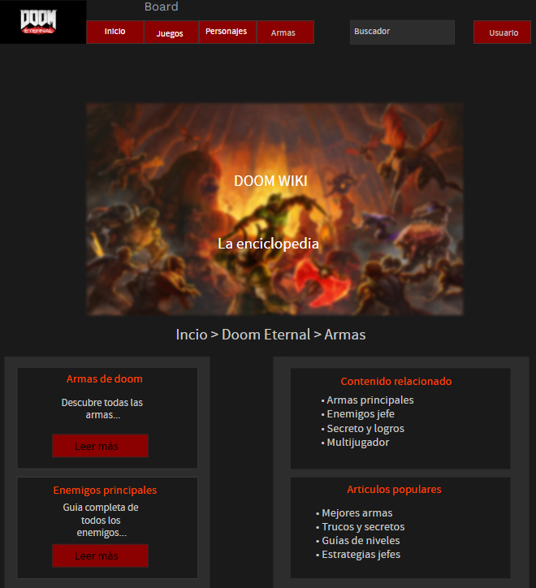

# JDESAWEB25
# Página Web Informativa sobre DOOM: The Dark Age

## Descripción del proyecto

Este proyecto consiste en el desarrollo de una **página web completa** dedicada exclusivamente al videojuego *DOOM: The Dark Age*, recientemente anunciado por id Software. La plataforma servirá como **punto de encuentro para la comunidad de fans**, ofreciendo contenido actualizado, información detallada del juego y espacios de interacción para los usuarios.

> "La idea es hacer un lugar en español donde se pueda encontrar toda la información sobre DOOM a disposición de la comunidad hispanohablante". La Dark Ages".

El sitio web contará con tres áreas diferenciadas:
- Zona pública accesible para todos los visitantes
- Zona privada para usuarios registrados
- Panel de administración para la gestión de contenidos y usuarios

## Público objetivo

El proyecto está dirigido principalmente a:
- **Fans de la saga DOOM** gente de España
- **Jugadores casuales** gente interesada en conocer más sobre el juego
- **Comunidad gaming** que busca información actualizada y confiable
- **Administradores de contenido** que mantendrán la plataforma actualizada

## Funcionalidades principales

### Para visitantes no registrados
- Navegación por contenido público del juego
- Acceso a información sobre personajes, armas y estrategias
- Visualización de noticias y actualizaciones

### Para usuarios registrados
- Sistema de comentarios en noticias y contenido
- Perfil personalizable
- Participación en la comunidad

### Para administradores
- Gestión completa de usuarios y contenidos
- Moderación de comentarios
- Publicación de noticias y actualizaciones

## Tecnologías previstas

### Frontend
- **HTML** para estructura semántica
- **CSS** con Flexbox/Grid para diseño responsive
- **JavaScript** para interactividad del cliente

### Backend
- **PHP** como lenguaje de programación del servidor
- **MySQL** para gestión de base de datos relacional

### Herramientas de desarrollo
```html
<!-- Ejemplo de estructura básica -->
<!DOCTYPE html>
<html lang="es">
<head>
    <meta charset="UTF-8">
    <meta name="viewport" content="width=device-width, initial-scale=1.0">
    <title>DOOM: The Dark Age - Comunidad</title>
    <link rel="stylesheet" href="styles.css">
</head>
<body>
    <header>
        <nav><!-- Navegación principal --></nav>
    </header>
    <main><!-- Contenido principal --></main>
    <footer><!-- Pie de página --></footer>
</body>
</html>
```

## Planificación de desarrollo

1. **Semanas 1-2**: Planificación y diseño
2. **Semanas 3-4**: Desarrollo del backend
3. **Semanas 5-6**: Desarrollo del frontend
4. **Semana 7**: Integración y pruebas
5. **Semana 8**: Despliegue y documentación

## Roles de usuario y permisos

| Rol | Permisos | Accesos |
|-----|----------|---------|
| Visitante | Lectura | Contenido público |
| Usuario registrado | Lectura, comentarios | Zona privada básica |
| Moderador | Gestión de comentarios | Panel de moderación |
| Administrador | Control total | Panel de administración completo |

## Características técnicas destacadas

- *Arquitectura cliente-servidor* tradicional
- *Diseño responsive* para múltiples dispositivos
- *Sistema de autenticación seguro*
- *Base de datos optimizada* para rendimiento
- *Interfaz con estética oscura* inspirada en DOOM

## Recursos y documentación

### Enlaces externos de referencia
- [Documentación oficial de PHP](https://www.php.net/docs.php) - Manual completo para el desarrollo del backend
- [MDN Web Docs](https://developer.mozilla.org/) - Referencia esencial para HTML, CSS y JavaScript
- [DOOM Wiki oficial](https://doom.fandom.com/) - Fuente de información sobre la saga DOOM

### Herramientas utilizadas

[](https://code.visualstudio.com/) *Editor de código principal*

[](https://github.com/) *Control de versiones y repositorio*

### Diseño y prototipado


*Boceto preliminar de la página principal con estética DOOM*

## Futuras mejoras contempladas

- Sistema de valoración de contenidos
- Integración con APIs oficiales de DOOM
- Foros de discusión más elaborados
- Aplicación móvil complementaria
- Sistema de logros para usuarios activos

---
